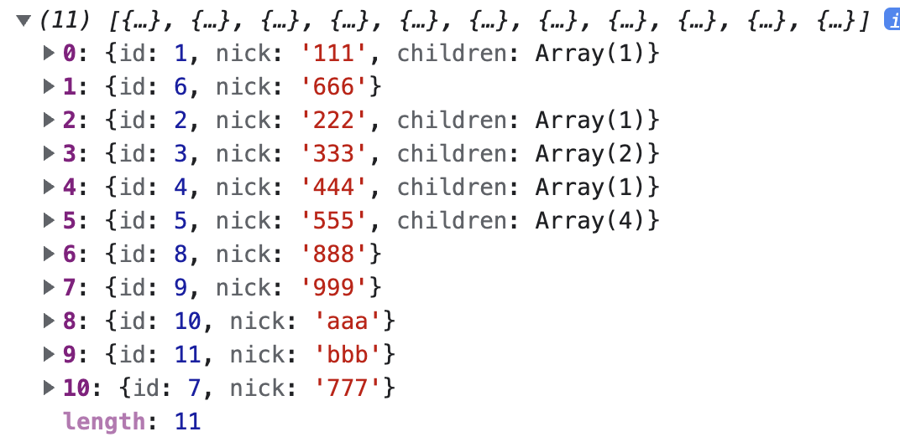
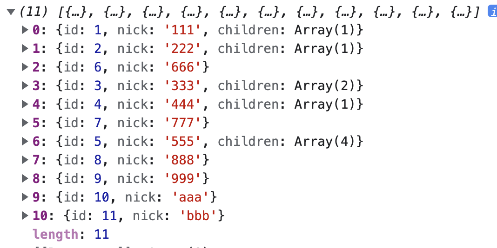

<!--
 * @Description:
 * @Author: zhengfei.tan
 * @Date: 2024-05-01 13:11:08
 * @FilePath: \VitePress\docs\01.JavaScript\树形结构.md
-->

# 树结构

## 树形结构转为扁平数组结构

```javascript
const tree = [
  {
    id: 1,
    nick: '111',
    children: [{ id: 6, nick: '666' }],
  },
  {
    id: 2,
    nick: '222',
    children: [
      {
        id: 3,
        nick: '333',
        children: [
          {
            id: 4,
            nick: '444',
            children: [
              {
                id: 5,
                nick: '555',
                children: [
                  { id: 8, nick: '888' },
                  { id: 9, nick: '999' },
                  { id: 10, nick: 'aaa' },
                  { id: 11, nick: 'bbb' },
                ],
              },
            ],
          },
          { id: 7, nick: '777' },
        ],
      },
    ],
  },
]
```

这是一个多层级的树形结构，我们把它转成数组。

这里我们有两个方式来进行转换：深度优先和广度优先。即优先使用当前节点的子节点，还是优先当前节点的兄弟节点。

1. 深度优先转换
   深度优先，即若当前节点有子节点，优先遍历子节点，直到没有子节点，才遍历其兄弟节点

```javascript
// 深度优先
const treeToListDepth = (tree, pid = 0) => {
  let result = []

  tree.forEach(item => {
    result.push({ ...item, pid }) // 将该节点压进去

    // 若该节点有子节点，则优先执行子节点
    if (Array.isArray(item.children) && item.children.length) {
      result = result.concat(treeToListDepth(item.children, item.id))
    }
  })
  return result
}
```

输出下结果：



从数组的排列顺序中，也能看到，子节点要比兄弟节点更靠前。

2. 广度优先转换
   广度优先，即若当前节点有兄弟，优先遍历兄弟节点，有子节点时，则先存起来，等待后续的遍历。

```javascript
const treeToListBreadth = tree => {
  let queue = tree // 用一个队列来存储将要遍历的节点
  const result = []

  while (queue.length) {
    const item = queue.shift()
    result.push(item)

    // 子节点存储到队列中，等待遍历
    if (Array.isArray(item.children) && item.children.length) {
      queue = queue.concat(item.children)
    }
  }
  return result
}
```

出下结果：



从数组的排列顺序中，也能看到，兄弟节点要比子节点更靠前。

---

## 数组转树形结构

```javascript
function getTree(list) {
  const map = {}
  const tree = []

  // 第一次遍历：构建节点映射
  for (const item of list) {
    map[item.id] = item
  }

  // 第二次遍历：构建树结构
  for (const item of list) {
    if (item.parentId) {
      // 确保父节点存在children数组
      ;(map[item.parentId].children || (map[item.parentId].children = [])).push(item)
    } else {
      tree.push(item)
    }
  }

  return tree
}
```
