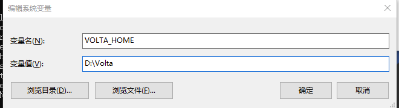

<!--
 * @Description: 
 * @Author: zhengfei.tan
 * @Date: 2024-01-24 14:23:12
 * @FilePath: \VitePress\docs\02.NodeJs\volta.md
 * @LastEditors: zhengfei.tan
 * @LastEditTime: 2024-01-25 13:06:54
-->


安装node

下载后安装即可，不能自定义盘符安装

安装完成后 以行✨管理员身份✨运行 命令提示符 | 利用 volta 安装 node.js

> 可能会遇到下载失败或慢的问题，解决方案

官网安装地址：volta官网安装地址
https://docs.volta.sh/guide/getting-started

新建系统变量



在系统变量中找到path，编辑替换volta默认的位置为%VOLTA_HOME%

修改用户环境变量path中的votal路径替换为%VOLTA_HOME%\bin


根据 Node.js 官网我们得知：每个版本的偶数版本是LTS稳定版，打开以前的版本(nodejs.org)官网辨别每个大版本的稳定版，复制版本号去清华大学开源软件镜像站中 ctrl+f 搜索并点击下载对应的node-vxx.xx.xx-win-64.zip (以win举例，mac | linux自行选择)

node下载地址：node下载地址
https://registry.npmmirror.com/binary.html?path=node


下好放到你的安装目录x:\Volta\tools\inventory\node

> volta install node@xx.xx.xx


安装完成后每个node版本中都有对应的npm，你也可以安装yarn和pnpm

> 当你安装完yarn后，而使用报错时，在 Windows 上，配置环境变量YARN_IGNORE_NODE设置为1。可以将其添加到系统设置中的用户或系统环境变量中并重启电脑。

> volta install yarn

> 安装pnpm需要node版本16以上
值得注意的是pnpm目前处于实验阶段(如果你通过volta安装pnpm失败时)。你需要单独配置启用它
在 Windows 上，配置环境变量VOLTA_FEATURE_PNPM设置为1。可以将其添加到系统设置中的用户或系统环境变量中并重启电脑。在 Linux/Mac 上，您可以在配置文件脚本中设置值（如.bash_profile、.zshrc或类似的）。由于此支持是实验性的（后续应该会做包管理工具兼容），暂时不支持pnpm的

> volta install pnpm

管理项目的node版本(在项目根目录中安装依赖前先在终端执行再安装项目依赖)

> volta pin node@xx.xx.xx
// 程序包管理器 cnpm yarn pnpm 等
volta pin npm@xx.xx.xx

Volta 会把这个放在你的 package.json，这样你就可以把你选择的工具提交到版本控制:

```
"volta": {
  "node": "xx.xx.xx",
  "npm": "x.xx.x"
}
```


```
volta fetch 将工具缓存到本地机器以供离线使用

volta install 设置工具的默认版本

volta uninstall 从工具链中卸载工具

volta pin 固定项目的运行时或包管理器

volta list 显示当前工具链

volta list all 显示所有工具链

volta completions 命令补全

volta which 查看 volta 安装的工具的目录

volta setup 为当前用户/shell 启用 volta

volta run 运行带有自定义Node、npm、pnpm和/或Yarn版本的命令

volta help 输出帮助信息
```


pnpm 修改安装依赖位置
> pnpm config set store-dir "D:\pnpm"


pnpm 修改安装依赖位置
> pnpm config set store-dir "D:\pnpm"

pnpm 验证存储路径
> pnpm store path

pnpm 修改缓存位置(缓存依赖)
> pnpm config set cache-dir "D:\pnpm"

pnpm 查看配置
> pnpm config list

