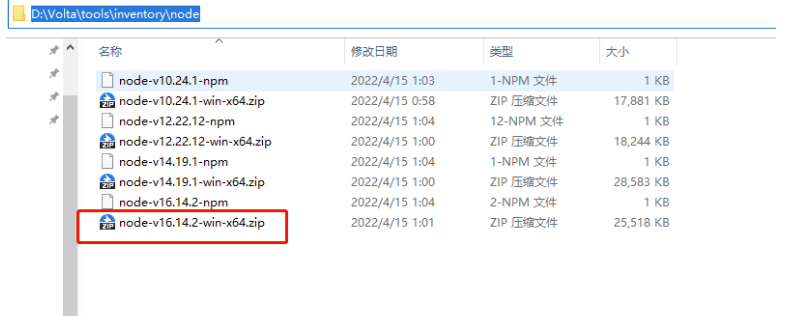

<!--
 * @Description:
 * @Author: zhengfei.tan
 * @Date: 2024-01-24 14:23:12
 * @FilePath: \VitePress\docs\02.NodeJs\volta.md
 * @LastEditors: zhengfei.tan
 * @LastEditTime: 2024-02-02 17:28:59
-->

安装 node

下载后安装即可，不能自定义盘符安装

安装完成后 以行 ✨ 管理员身份 ✨ 运行 命令提示符 | 利用 volta  安装 node.js

> 可能会遇到下载失败或慢的问题，解决方案

官网安装地址：volta 官网安装地址
https://docs.volta.sh/guide/getting-started

新建系统变量


在系统变量中找到 path，编辑替换 volta 默认的位置为%VOLTA_HOME%

修改用户环境变量 path 中的 votal 路径替换为%VOLTA_HOME%\bin

根据 Node.js 官网我们得知：每个版本的偶数版本是 LTS 稳定版，打开以前的版本(nodejs.org)官网辨别每个大版本的稳定版，复制版本号去清华大学开源软件镜像站中 ctrl+f 搜索并点击下载对应的 node-vxx.xx.xx-win-64.zip (以 win 举例，mac | linux 自行选择)

node 下载地址：node 下载地址
https://registry.npmmirror.com/binary.html?path=node



下好放到你的安装目录 x:\Volta\tools\inventory\node

> volta install node@xx.xx.xx

安装完成后每个 node 版本中都有对应的 npm，你也可以安装 yarn 和 pnpm

> 当你安装完 yarn 后，而使用报错时，在 Windows 上，配置环境变量 YARN_IGNORE_NODE 设置为 1。可以将其添加到系统设置中的用户或系统环境变量中并重启电脑。

> volta install yarn

> 安装 pnpm 需要 node 版本 16 以上
> 值得注意的是 pnpm 目前处于实验阶段(如果你通过 volta 安装 pnpm 失败时)。你需要单独配置启用它
> 在 Windows 上，配置环境变量 VOLTA_FEATURE_PNPM 设置为 1。可以将其添加到系统设置中的用户或系统环境变量中并重启电脑。在 Linux/Mac 上，您可以在配置文件脚本中设置值（如.bash_profile、.zshrc 或类似的）。由于此支持是实验性的（后续应该会做包管理工具兼容），暂时不支持 pnpm 的

> volta install pnpm

管理项目的 node 版本(在项目根目录中安装依赖前先在终端执行再安装项目依赖)

> volta pin node@xx.xx.xx
> // 程序包管理器 cnpm yarn pnpm 等
> volta pin npm@xx.xx.xx

Volta 会把这个放在你的 package.json，这样你就可以把你选择的工具提交到版本控制:

```
"volta": {
  "node": "xx.xx.xx",
  "npm": "x.xx.x"
}
```

```
volta fetch 将工具缓存到本地机器以供离线使用

volta install 设置工具的默认版本

volta uninstall 从工具链中卸载工具

volta pin 固定项目的运行时或包管理器

volta list 显示当前工具链

volta list all 显示所有工具链

volta completions 命令补全

volta which 查看 volta 安装的工具的目录

volta setup 为当前用户/shell 启用 volta

volta run 运行带有自定义Node、npm、pnpm和/或Yarn版本的命令

volta help 输出帮助信息
```

pnpm 修改安装依赖位置

> pnpm config set store-dir "D:\pnpm"

pnpm 修改安装依赖位置

> pnpm config set store-dir "D:\pnpm"

pnpm 验证存储路径

> pnpm store path

pnpm 修改缓存位置(缓存依赖)

> pnpm config set cache-dir "D:\pnpm"

pnpm 查看配置

> pnpm config list
