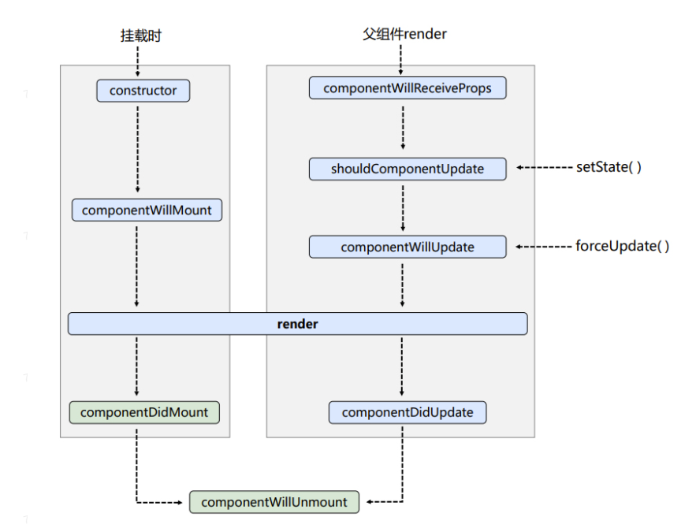
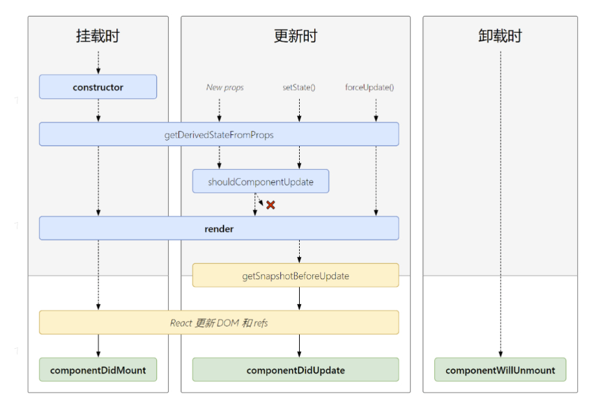

<!--
 * @Description:
 * @Author: zhengfei.tan
 * @Date: 2024-01-11 21:38:28
 * @FilePath: \VitePress\docs\08.React\React基础.md
 * @LastEditors: zhengfei.tan
 * @LastEditTime: 2024-02-01 16:45:46
-->

# 07.React

## React 绑定*this*,常见解决办法

1. 在render方法种使用箭头函数
   在 React 中，使用箭头函数来绑定 this 是常见做法。这是因为箭头函数会自动将 this 绑定到定义时的上下文。这样可以避免手动绑定*this*的问题。
   例如：

```js
class App extends React.Component {
  handleClick() {
    console.log('this > ', this)
  }
  render() {
    return <div onClick={() => this.handleClick()}>test</div>
  }
}
```

2. bind
   你也可以使用 bind 方法来手动绑定*this*。通过在函数定义时调用 bind 方法，可以将函数中的 this 绑定到指定的上下文。

```js
class App extends React.Component {
  handleClick() {
    console.log('this > ', this)
  }
  render() {
    return <div onClick={this.handleClick.bind(this)}>test</div>
  }
}
```

3. 构造函数
   你可以在构造函数中手动绑定*this*。通过在构造函数中使用 bind 方法，可以将函数中的 this 绑定到指定的上下文。

```js
class App extends React.Component {
  constructor(props) {
    super(props)
    this.handleClick = this.handleClick.bind(this)
  }
  handleClick() {
    console.log('this > ', this)
  }
  render() {
    return <div onClick={this.handleClick}>test</div>
  }
}
```

4. 在定义阶段使用箭头函数绑定*this*

```js
class App extends React.Component {
  handleClick = () =>{
    console.log('this > ', this)
  }
  render() {
    return <div onClick={this.handleClick}>test</div>
  }
}
```

## React 生命周期

React 生命周期是指 React 组件从创建到销毁的过程。在 React 16 版本中，引入了新的生命周期方法，以简化组件的生命周期管理。这些新的生命周期方法包括 getDerivedStateFromProps、getSnapshotBeforeUpdate 和 componentDidCatch。

```
挂载阶段包括以下方法：

- constructor：组件被创建时调用，用于初始化状态和绑定事件处理函数。
- getDerivedStateFromProps：在组件挂载之前和更新时调用，用于根据props更新state。
- render：根据props和state渲染组件。
- componentDidMount：组件挂载后调用，用于进行异步操作和DOM操作。

更新阶段包括以下方法：

- getDerivedStateFromProps：在组件更新时调用，用于根据props更新state。
- shouldComponentUpdate：在组件更新前调用，用于判断是否需要重新渲染组件。
- render：根据props和state渲染组件。
- componentDidUpdate：在组件更新后调用，用于进行异步操作和DOM操作。

卸载阶段包括以下方法：

- componentWillUnmount：在组件卸载前调用，用于清理定时器、取消订阅等操作。

```

## react更新触发生命周期

当React子组件发生改变时，父组件可能会触发以下生命周期方法：

```
1. componentWillReceiveProps(nextProps)
   当父组件接收到新的props时，会触发该生命周期方法。子组件的改变可能会导致父组件的props发生变化，从而触发该方法。

2. shouldComponentUpdate(nextProps, nextState)
   当父组件的props或state发生改变时，会触发该方法。该方法用于判断是否需要重新渲染组件。如果返回false，组件将不会更新。

3. componentWillUpdate(nextProps, nextState)
   在组件更新之前调用，可以在此方法中进行一些准备工作或进行一些副作用操作。

4. render()
   无论父组件的props或state是否发生改变，都会触发render方法重新渲染父组件。

5. componentDidUpdate(prevProps, prevState)
   在组件更新之后调用，可以在此方法中进行一些副作用操作，比如更新DOM或发送网络请求。

需要注意的是，以上生命周期方法中的一些在未来版本的React中可能会被废弃或改变。因此，建议在使用时查看React官方文档以获取最新信息。
```

## 类组件的生命周期-旧版



### 初始化

```javaScript
  // 当这个类被实例化的时候就会自动执行，最先执行，并且只执行一次
  constructor(props) {               // 当props的值需要作为state的初始值的时候
    super(props);                    //super必须写在最前面
    this.state = {
      count: 10,
    };
    this.ipt = createRef();         //非受控组件传值
  }
```

### 挂载阶段

```javaScript
 // componentWillMount是被废弃了, 改名成了UNSAFE_componentWillMount
  UNSAFE_componentWillMount() {
    console.log("componentWillMount");
    // componentWillMount不能做数据请求
    // 因为fiber算法的原因,可能导致这个生命周期被执行多次
  }

  // render本身就是一个生命周期,每次数据改变都重新渲染
  render() {
    console.log("render");
    return (
      <>
        <h3>老版生命周期</h3>
        <p>count: {this.state.count}</p>
      </>
    );
  }

  // 组件挂载完成之后
  componentDidMount() {
    console.log("componentDidMount");
    this.setState({
      count: 20,
    });
  }
```
### 更新阶段

```javaScript
// 被废弃了, 因为现在由更好的生命周期来代替
// 当父组件传递的自定义属性发生改变时就会触发
  UNSAFE_componentWillReceiveProps(nextProps) {
    console.log(nextProps);
  }
  
//决定子组件是否重新渲染
// 必须要返回true或者false, 通过返回true或者false来控制是否要重新渲染当前组件
// 可以接收两个参数，新的props和新的state，旧的还是this.props.xxx
// PureComponent 纯组件   用于代替Component
shouldComponentUpdate(nextProps, nextState) {
    return nextState.count !== this.state.count;
  }
  
// 被弃用
  UNSAFE_componentWillUpdate() {
    console.log("componentWillUpdate");
  }
   
// 更新结束
// 不能在这里更新数据
  componentDidUpdate() {
    console.log("componentDidUpdate");
  } 

```

### 卸载阶段

```javaScript
//组件将要销毁
componentWillUnmount() {
    // 定时器，事件监听，websocket, 插件等
    console.log("componentWillUnmount");
  }

```

## 类组件的生命周期-新版




### getDerivedStateFromProps

```javaScript
// 根据props的值去获取一个新的state
// 它前面要有一个static关键字
// 必须要return 对象或者null  如果null表示啥也不做，如果是对象就会合并之前的state
static getDerivedStateFromProps(props, state) {
    console.log("getDerivedStateFromProps");
    return null;
  }
```

### getSnapshotBeforeUpdate

```javaScript
// 生成一个快照在更新之前
// 拿到更新前的状态给更新以后用
  getSnapshotBeforeUpdate(prevProps, prevState) {
    // 快照就是某一条记录或者某一个值，return出来被销毁周期接收
    return prevState;
  }
  
// componentDidUpdate第三个参数就是getSnapshotBeforeUpdate里面return的那个值
  componentDidUpdate(prevProps, prevState, snapshot) {
    console.log(snapshot);
  }
```


## React 中的高阶组件

高阶组件（HOC）是 React 中的一种高级组件设计模式，它是一种用于组件复用的函数。高阶组件接收一个组件作为参数，并返回一个新的组件。高阶组件可以用于封装通用逻辑、状态管理、组件组合等。


## React 中的 refs

refs 是 React 中用于访问 DOM 元素或组件实例的属性。通过在组件中定义 ref 属性，可以将 refs 绑定到组件实例或 DOM 元素上。在组件挂载后
，可以通过 refs 访问相应的 DOM 元素或组件实例。

## React 中的事件处理

React 中的事件处理与 DOM 中的事件处理类似。通过在组件中定义事件处理函数，并在事件发生时调用该函数，可以实现事件处理。在事件处理函数中，可以通过 event 对象访问事件的相关信息，例如事件类型、目标元素等。

## 对React看法，它的优缺点

React 的优点：

- 声明式编码：React 使用声明式编码，使得代码更加简洁和可读。
- 组件化开发：React 支持组件化开发，可以将应用程序拆分为多个可重用的组件。
- 虚拟 DOM：React 使用虚拟 DOM 进行 diff 算法，使得渲染性能得到提升。
- 单向数据流：React 采用单向数据流，使得应用程序的状态更加清晰和易于管理。

React 的缺点：

- 学习曲线陡峭：React 学习曲线较陡峭，需要花一些时间来掌握其基本概念和用法。
- 性能优化难度大：React 的性能优化难度较大，需要使用一些性能优化工具和最佳实践来提高应用程序的性能。
- 社区生态尚待完善：React 的社区生态尚待完善，需要等待更多的第三方库和工具的出现。

## React的理念是什么（拿函数式编程来做页面渲染）

```
React 是一个用于构建用户界面的 JavaScript 库。它使用虚拟 DOM 和函数式编程的概念来优化页面的渲染性能。
```


## React虚拟DOM（Virtual DOM）

React 的虚拟 DOM 是一个 JavaScript 对象，它表示真实 DOM 树的结构和属性。React 将真实 DOM 树的状态保存在虚拟 DOM 对象中，并在需要时更新真实 DOM 树的状态。这样，React 就可以在保证性能的同时，实现页面的快速更新。

```

React提出的一种解决方案，它是一个轻量级的JavaScript对象，用来描述真实DOM的结构和属性。React通过比较虚拟DOM的差异，计算出需要更新的部分，然后再将这些部分更新到真实DOM上。React虚拟DOM的原理是：
1. 首先，React将组件的状态和属性传入组件的render方法，得到一个虚拟DOM树。
2. 当组件的状态或属性发生变化时，React会再次调用render方法得到新的虚拟DOM树。
3. React会将新旧两棵虚拟DOM树进行比较，得到它们的不同之处。
4. React会将这些不同之处记录下来，然后批量的更新到真实的DOM树上。

React通过虚拟DOM树的比较，避免了直接操作真实DOM树带来的性能问题，因为直接操作真实DOM树会带来大量的重排和重绘，而React的虚拟DOM树的比较和更新是基于JavaScript对象进行的，不会导致页面的重排和重绘。
总结起来，React虚拟DOM的原理就是：通过比较虚拟DOM树的不同，批量的更新真实的DOM树，从而提高页面的性能。
```

## React的diff算法

```
React Diff是React中用于更新Virtual DOM的算法它的目的是在最小化DOM操作的同时，尽可能快地更新组件。它通过比较Virtual DOM树的前后两个状态来确定哪些部分需要更新。

React Diff算法的核心思想是尽可能地复用已有的DOM节点。当Virtual DOM中的某个节点发生变化时，React会先比较该节点的属性和子节点是否有变化，如果没有变化，则直接复用该节点。如果有变化，则会在该节点的父节点下创建一个新的节点，并将新的属性和子节点赋值给该节点。

React Diff算法的具体实现有两种方式：深度优先遍历和广度优先遍历。深度优先遍历是指先比较父节点的子节点，如果子节点有变化，则递归比较子节点的子节点。广度优先遍历是指先比较同级节点，如果同级节点有变化，则递归比较子节点。

React Diff算法的优化策略包括：key属性的使用、组件的shouldComponentUpdate方法、使用Immutable.js等。其中，key属性的使用是最常用的优化策略，它可以帮助React更准确地判断哪些节点需要更新，从而减少不必要的DOM操作。

React Diff算法具有以下特点：
1. 先判断两个节点是否相等，如果相等，就不需要更新。
2. 如果两个节点类型不同，则直接替换节点。
3. 如果节点类型相同，但是节点属性不同，则更新节点属性。
4. 如果节点类型相同，但是子节点不同，则使用递归的方式进行更新。
React Diff算法的时间复杂度是O(n)，其中n为Virtual DOM树中节点的数量。

// 实例：
在React中，渲染数组时将数组的第一项移动到最后渲染的开销通常比将最后一项移动到第一项渲染的开销要大：

这是因为React使用了虚拟DOM（Virtual DOM）来进行高效的DOM操作。
当数组中的元素发生变化时，React会比较新旧虚拟DOM树的差异，并只更新需要更新的部分。
如果将数组的第一项移动到最后，React需要重新计算并比较整个数组的差异，这可能会导致更多的DOM操作。
相比之下，将最后一项移动到第一项只会影响数组的第一项和最后一项，而不会影响其他元素的位置。
因此，React只需要比较这两个元素的差异，并进行相应的DOM操作，这通常比重新计算整个数组的差异要更高效。

```

