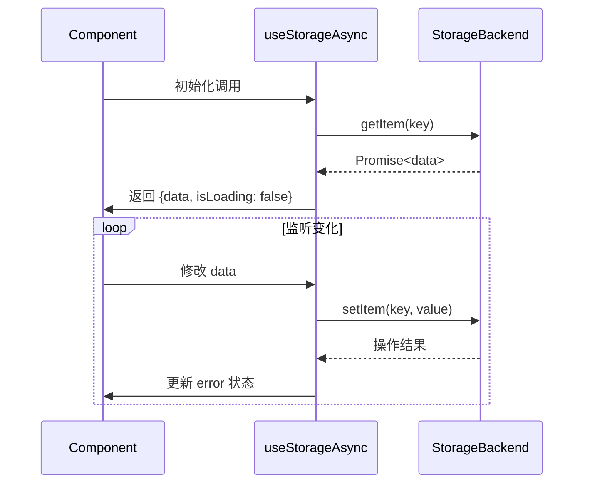

# VueUse useStorageAsync 源码解析及使用指南

## 一、核心定位与特性

`useStorageAsync` 是 VueUse 中处理异步存储操作的响应式工具，专为以下场景设计：

- 🌐 对接异步存储后端（如 IndexedDB、远程 API）
- ⏳ 处理需要延迟加载的存储数据
- 🔄 管理异步操作状态（loading/error）
- 🛡️ 支持复杂事务操作（读写分离）

### 与同步版本对比

| 特性         | useStorage      | useStorageAsync    |
| ------------ | --------------- | ------------------ |
| 数据访问模式 | 同步            | 异步               |
| 适用存储类型 | localStorage 等 | IndexedDB/API 等   |
| 状态管理     | 无              | 内置 loading/error |
| 数据一致性   | 即时生效        | 需处理异步延迟     |
| 错误处理     | 基础错误捕获    | 细粒度错误状态     |

## 二、源码架构解析（基于 vueuse v9.0.0）

### 1. 函数签名

```typescript
export function useStorageAsync<T>(
  key: string,
  initialValue: MaybeRef<T>,
  storage: AsyncStorageLike,
  options: UseStorageAsyncOptions<T> = {}
): AsyncStorageReturn<T>
```

### 2. 核心状态管理

```typescript
interface AsyncStorageState<T> {
  data: Ref<T>
  isLoading: Ref<boolean>
  error: Ref<unknown | null>
  refresh: () => Promise<void>
  write: () => Promise<void>
}
```

### 3. 核心实现流程图



## 三、关键技术实现

### 1. 异步状态机管理

```typescript
const state = reactive({
  data: ref(initialValue),
  isLoading: true,
  error: null,
})

try {
  const storedValue = await storage.getItem(key)
  state.data = storedValue ?? initialValue
  state.isLoading = false
} catch (e) {
  state.error = e
  state.isLoading = false
}
```

### 2. 写操作队列化

```typescript
const writeQueue = []
let isWriting = false

const processQueue = async () => {
  if (isWriting) return
  isWriting = true

  while (writeQueue.length) {
    const { key, value } = writeQueue.shift()
    try {
      await storage.setItem(key, value)
    } catch (e) {
      handleError(e)
    }
  }

  isWriting = false
}

const scheduleWrite = value => {
  writeQueue.push({ key, value })
  processQueue()
}
```

### 3. 竞态条件处理

```typescript
let requestId = 0

const fetchData = async () => {
  const currentId = ++requestId
  try {
    const result = await storage.getItem(key)
    if (currentId === requestId) {
      state.data = result
    }
  } catch (e) {
    if (currentId === requestId) {
      state.error = e
    }
  }
}
```

## 四、使用示例大全

### 1. 基础使用

```typescript
// 对接 IndexedDB
const idbStorage = {
  getItem: key => idb.get(key),
  setItem: (key, val) => idb.set(key, val),
}

const { data, isLoading, error } = useStorageAsync('user-data', { name: 'Guest' }, idbStorage)
```

### 2. 远程 API 集成

```typescript
const apiStorage = {
  getItem: async key => {
    const res = await fetch(`/api/storage/${key}`)
    return res.json()
  },
  setItem: async (key, val) => {
    await fetch(`/api/storage/${key}`, {
      method: 'PUT',
      body: JSON.stringify(val),
    })
  },
}

const settings = useStorageAsync('preferences', defaultSettings, apiStorage)
```

### 3. 复杂事务操作

```typescript
const { data, write } = useStorageAsync('doc-content', '', storage, {
  flushMode: 'manual',
})

// 手动控制写入时机
const autoSave = useDebounceFn(() => {
  write()
}, 1000)

watch(data, autoSave)
```

## 五、高级配置选项

```typescript
interface UseStorageAsyncOptions<T> {
  // 合并策略
  mergeDefaults?: boolean
  // 错误监听
  onError?: (e: unknown) => void
  // 深监听模式
  deep?: boolean
  // 写入模式
  flushMode?: 'auto' | 'manual' | 'debounce'
  // 防抖时间
  debounce?: number
  // 重试策略
  retry?: {
    attempts: number
    delay: number | ((attempt: number) => number)
  }
}
```

## 六、最佳实践场景

### 1. 大文件分块上传

```typescript
const chunkStorage = {
  async getItem(key) {
    const chunks = await listChunks(key)
    return assembleChunks(chunks)
  },
  async setItem(key, file) {
    const chunks = splitFile(file)
    await Promise.all(chunks.map((chunk, i) => uploadChunk(key, i, chunk)))
  },
}

const fileUploader = useStorageAsync('big-file', null, chunkStorage, {
  flushMode: 'manual',
})
```

### 2. 离线优先策略

```typescript
const hybridStorage = {
  async getItem(key) {
    try {
      // 优先读取远程
      return await fetchRemote(key)
    } catch (e) {
      // 降级本地存储
      return localStorage.get(key)
    }
  },
  async setItem(key, val) {
    // 双写策略
    await Promise.all([localStorage.set(key, val), fetchRemoteUpdate(key, val)])
  },
}
```

## 七、错误处理机制

### 1. 重试策略实现

```typescript
const withRetry = (fn, options) => {
  return async (...args) => {
    let attempt = 0
    while (true) {
      try {
        return await fn(...args)
      } catch (e) {
        if (attempt >= options.attempts) throw e
        const delay = typeof options.delay === 'function' ? options.delay(attempt) : options.delay
        await new Promise(r => setTimeout(r, delay))
        attempt++
      }
    }
  }
}

const safeStorage = {
  getItem: withRetry(storage.getItem, {
    attempts: 3,
    delay: 1000,
  }),
}
```

### 2. 错误边界处理

```typescript
const { error, refresh } = useStorageAsync(/* ... */)

watch(error, err => {
  if (err?.code === 'NETWORK_ERROR') {
    showOfflineWarning()
    queueMicrotask(refresh)
  }
})
```

## 八、性能优化策略

### 1. 读写分离配置

```typescript
const highPerfStorage = {
  getItem: memoizeAsync(storage.getItem),
  setItem: debounce(storage.setItem, 500),
}

const analytics = useStorageAsync('track-events', [], highPerfStorage)
```

### 2. 数据快照优化

```typescript
let lastSnapshot = null

const storageWithDiff = {
  async setItem(key, newVal) {
    const diff = generateDiff(lastSnapshot, newVal)
    if (diff) {
      await applyPatch(key, diff)
      lastSnapshot = newVal
    }
  },
}
```

## 九、源码设计亮点

1. **异步队列管理**  
   使用写操作队列保证顺序一致性

2. **智能状态合并**

   ```typescript
   // 数据合并策略
   const mergeData = (existing, incoming) => {
     if (options.mergeDefaults) {
       return deepMerge(existing, incoming)
     }
     return incoming ?? existing
   }
   ```

3. **生命周期绑定**  
   自动在组件卸载时终止进行中的异步操作

## 十、总结与适用场景

### 适用场景推荐

- 🚀 需要对接异步存储后端
- 💾 处理大型数据集的延迟加载
- 🔄 需要精确控制写入时序
- 🌩️ 实现离线优先架构

### 性能关键点

1. 避免高频小数据写入
2. 合理设置 debounce 参数
3. 采用适当的数据分块策略
4. 使用缓存机制减少 IO 次数

通过合理运用 `useStorageAsync`，开发者可以轻松构建复杂的异步数据存储交互，同时保持 Vue 应用的响应式特性。该 API 在保持易用性的同时，为高级场景提供了充分的扩展能力。
