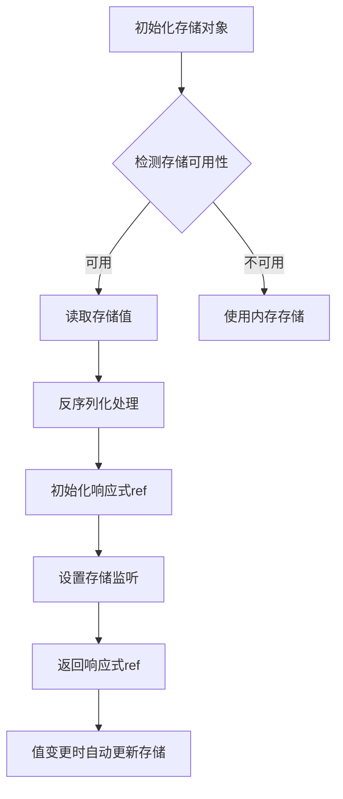

<!--
 * @Description:
 * @Author: zhengfei.tan
 * @Date: 2025-03-31 22:59:01
 * @FilePath: \VitePress\docs\VueuseSource\useStorage源码解析.md
-->

# VueUse useStorage 源码解析及使用指南

## 一、核心功能与特性

`useStorage` 是 VueUse 中用于实现浏览器存储（localStorage/sessionStorage）与 Vue 响应式状态双向同步的工具函数，具备以下核心能力：

- 🌐 自动 JSON 序列化/反序列化
- 🔄 跨标签页数据同步（监听 storage 事件）
- 🛡️ SSR 友好支持
- 🎛️ 支持自定义序列化器
- 💾 存储失败自动降级（内存存储）
- ⚡ 响应式数据实时同步

## 二、源码结构解析（基于 vueuse v9.0.0）

### 1. 函数签名

```typescript
function useStorage<T>(
  key: string,
  initialValue: MaybeRef<T>,
  storage: StorageLike | undefined = isClient ? localStorage : undefined,
  options: UseStorageOptions<T> = {}
): RemovableRef<T>
```

### 2. 核心实现流程图



### 3. 关键源码片段

```typescript
// 核心更新逻辑
function update(event?: StorageEvent) {
  if (!event || event.key === key) {
    try {
      const rawValue = event?.newValue ?? storage.getItem(key)
      if (rawValue === null && initialValue !== undefined) {
        data.value = initialValue
        write()
      } else {
        data.value = rawValue ? serializer.deserialize(rawValue) : null
      }
    } catch (e) {
      onError(e)
    }
  }
}

// 存储监听实现
if (isClient && passToListeners) {
  useEventListener(window, 'storage', update)
}

// 错误处理逻辑
const onError = (e: unknown) => {
  console.warn(e)
  // 降级为内存存储
  if (data.value === null && initialValue !== undefined) data.value = initialValue
}
```

## 三、关键技术点详解

### 1. 智能存储检测

```typescript
// 存储可用性检测逻辑
const isClient = typeof window !== 'undefined'
const hasWebStorage = isClient && typeof storage !== 'undefined'

// 降级内存存储实现
const memory = new Map<string, string>()
const dummyStorage: StorageLike = {
  getItem: key => memory.get(key) ?? null,
  setItem: (key, value) => memory.set(key, value),
  removeItem: key => memory.delete(key),
}
```

### 2. 序列化系统设计

```typescript
// 默认序列化器
const defaultSerializer: Serializer<T> = {
  read: (v: string) => {
    try {
      return JSON.parse(v)
    } catch (e) {
      return v
    }
  },
  write: (v: T) => JSON.stringify(v),
}

// 自定义序列化器处理
const serializer = options.serializer ?? defaultSerializer
```

### 3. 性能优化策略

```typescript
// 写操作节流处理
const write = useThrottleFn(() => {
  try {
    if (data.value == null) {
      storage.removeItem(key)
    } else {
      storage.setItem(key, serializer.write(data.value))
    }
  } catch (e) {
    onError(e)
  }
}, options.flush ?? 'pre')
```

## 四、使用示例大全

### 1. 基础使用

```typescript
// 自动同步到 localStorage
const count = useStorage('counter', 0)

// 显示使用 sessionStorage
const sessionToken = useStorage('auth-token', null, sessionStorage)

// 响应式更新示例
const increment = () => count.value++
```

### 2. 自定义序列化器

```typescript
// Date 对象序列化
const dateSerializer = {
  read: (v: string) => new Date(parseInt(v)),
  write: (v: Date) => v.getTime().toString(),
}

const expiration = useStorage('expiration', new Date(), undefined, {
  serializer: dateSerializer,
})
```

### 3. 复杂数据结构

```typescript
// 嵌套对象处理
const userSettings = useStorage('user-settings', {
  theme: 'dark',
  preferences: {
    fontSize: 16,
    notifications: true,
  },
})

// 修改嵌套属性
userSettings.value.preferences.fontSize = 14
```

### 4. 高级配置选项

```typescript
// 禁用事件监听
const localData = useStorage('local-data', {}, undefined, {
  listenToStorageChanges: false,
})

// 自定义错误处理
const safeStorage = useStorage('critical-data', {}, undefined, {
  onError: e => {
    Sentry.captureException(e)
    showErrorToast('存储失败')
  },
})
```

## 五、SSR 场景处理

### 1. Nuxt.js 集成示例

```typescript
// plugins/storage.ts
export default defineNuxtPlugin(() => {
  const cookieStorage = {
    getItem: (key: string) => useCookie(key).value,
    setItem: (key: string, value: string) => (useCookie(key).value = value),
  }

  return {
    provide: {
      useStorage: (key: string, value: any) => useStorage(key, value, cookieStorage),
    },
  }
})
```

### 2. 服务端数据水合

```typescript
// 组件内使用
const serverData = useStorage(
  'ssr-data',
  initValue,
  process.client
    ? localStorage
    : {
        getItem: () => initValue,
        setItem: () => {},
      }
)
```

## 六、性能与安全

### 1. 性能优化建议

- 对高频更新操作使用 `flush: 'post'` 选项
- 大数据结构推荐使用压缩序列化器
- 避免在存储中保存频繁变化的非关键数据

### 2. 安全实践

```typescript
// 加密存储示例
const cryptoSerializer = {
  read: (v: string) => decrypt(v),
  write: (v: any) => encrypt(JSON.stringify(v)),
}

const secureStorage = useStorage('secret', data, undefined, {
  serializer: cryptoSerializer,
})
```

## 七、实现原理深度剖析

### 1. 响应式同步机制

```typescript
// 核心监听实现
watch(
  data,
  () => {
    if (updating) return
    write()
  },
  { deep: options.deep }
)
```

### 2. 存储事件处理

```typescript
// 跨标签页同步逻辑
const updateFromStorage = (event: StorageEvent) => {
  if (event.key !== key) return
  updating = true
  try {
    data.value = event.newValue ? serializer.read(event.newValue) : null
  } finally {
    updating = false
  }
}

if (listenToStorageChanges) {
  window.addEventListener('storage', updateFromStorage)
}
```

## 八、对比原生实现优势

| 功能点       | 原生实现         | useStorage           |
| ------------ | ---------------- | -------------------- |
| 响应式支持   | 需手动实现       | 自动同步             |
| 类型安全     | 无               | 完整 TypeScript 支持 |
| 错误处理     | 需自行封装       | 内置降级策略         |
| 跨标签页同步 | 需编写事件监听   | 自动处理             |
| 序列化处理   | 需手动 JSON 转换 | 智能处理复杂对象     |
| 性能优化     | 无               | 内置写操作节流       |

## 九、最佳实践场景

1. **用户偏好设置**

   ```typescript
   const settings = useStorage(
     'user-settings',
     {
       darkMode: true,
       locale: 'zh-CN',
       fontSize: 14,
     },
     localStorage,
     {
       mergeDefaults: true,
     }
   )
   ```

2. **表单草稿保存**

   ```typescript
   const draft = useStorage(
     'form-draft',
     {
       title: '',
       content: '',
       attachments: [],
     },
     undefined,
     {
       flush: 'post',
       deep: true,
     }
   )
   ```

3. **购物车状态维护**
   ```typescript
   const cart = useStorage<CartItem[]>('shopping-cart', [], sessionStorage, {
     serializer: {
       read: v => JSON.parse(v).map(validateCartItem),
       write: v => JSON.stringify(v.filter(purgeSensitiveData)),
     },
   })
   ```

## 十、注意事项

1. **存储限制**

   - 单个域名存储上限通常为 5MB
   - 超出限制会触发 QuotaExceededError

2. **敏感信息处理**

   - 避免存储明文密码/令牌
   - 推荐结合加密库使用

3. **数据类型限制**

   - 无法存储函数、Symbol 等特殊类型
   - 循环引用对象需要特殊处理

4. **框架集成**
   ```typescript
   // 在Vuex/Pinia中的使用
   const store = defineStore('main', () => {
     const persistedState = useStorage('store-state', {
       count: 0,
     })

     return { ...persistedState.value }
   })
   ```

## 十一、扩展应用

### 1. 实现过期机制

```typescript
function useExpirableStorage<T>(key: string, ttl: number) {
  const wrapper = useStorage<{
    data: T
    expires: number
  }>(key, { data: null, expires: 0 })

  const update = (value: T) => {
    wrapper.value = {
      data: value,
      expires: Date.now() + ttl,
    }
  }

  const current = computed(() => {
    if (Date.now() > wrapper.value.expires) {
      return null
    }
    return wrapper.value.data
  })

  return [current, update]
}
```

### 2. 实现存储空间监控

```typescript
const storageUsage = computed(() => {
  let total = 0
  for (let i = 0; i < localStorage.length; i++) {
    const key = localStorage.key(i)!
    total += localStorage.getItem(key)?.length || 0
  }
  return (total / 1024).toFixed(2) + 'KB'
})
```

## 十二、总结

`useStorage` 的实现展示了以下精妙设计：

1. **分层架构设计**  
   通过存储适配器模式，分离核心逻辑与具体存储实现

2. **防御性编程**  
   全面的错误捕获与降级策略确保代码健壮性

3. **性能平衡艺术**  
   智能的节流控制与批量更新策略

4. **扩展性设计**  
   开放的序列化器接口与配置选项

建议在以下场景优先选择：  
✅ 需要持久化的用户偏好设置  
✅ 跨页面/标签页的状态共享  
✅ 需要防止数据丢失的草稿功能  
✅ 轻量级状态持久化需求
