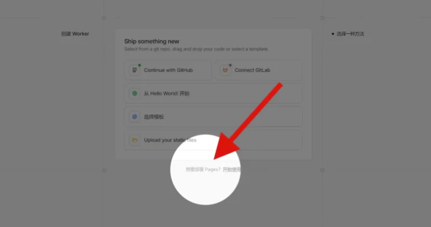
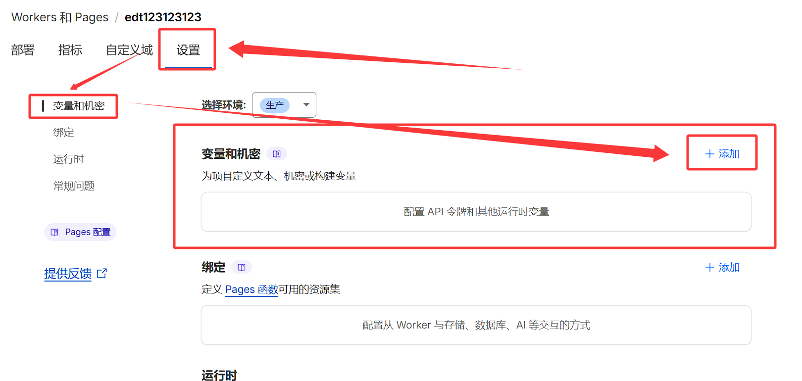
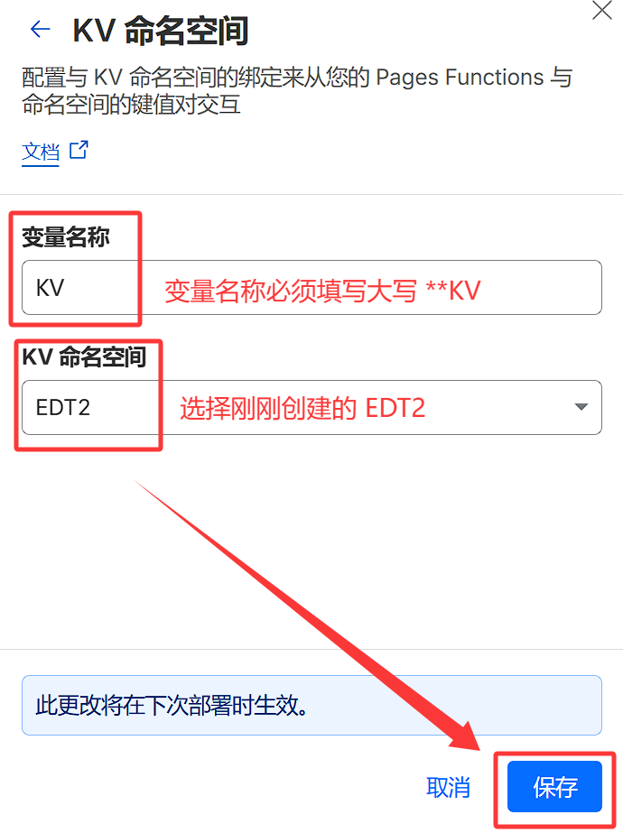
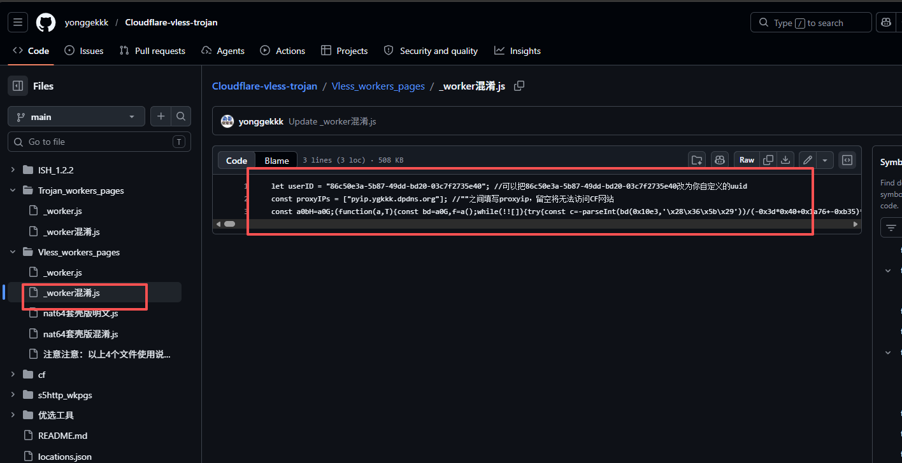

# cf 搭建订阅

## 第一种

注册并登入 Cloudflare 平台，

创建 KV 空间，在 Cloudflare 后台找到：存储和数据库 – Worker KV，来创建一个 KV 空间以备后面对接。

创建 Pages,在 Cloudflare 后台找到 Workers 和 Pages

进入以后，选择下方第二个选项，就是创建 Pages，如下图所示：



接着需要上传由 CMliu 开源的程序，他的源码是明文的，你可以自己去获取查看，目前是开源到 GitHub 上。或者直接下载 Pages 的专属安装包！

下载地址：https://pages.cloudflare.com/direct-upload-demo.zip

设置管理员变量

1. 进入项目设置页面，点击 设置 选项卡，添加变量和机密
   

2. 点击 + 添加，类型 文本 变量名称 ADMIN 变量，变量值为 WebUI 管理员密码，建议设置复杂密码，避免被暴力破解；

3. 绑定 KV 命名空间

点击 存储和数据库 > Workers KV > + Create Instance 创建一个命名空间；

命名空间名称可自定义，建议命名为 EDT2 以便区分，点击 创建 完成创建

返回项目设置页面，点击 设置 > 绑定 > + 添加 > KV 命名空间；



变量名称必须填写大写 KV ，命名空间选择刚刚创建的 EDT2，点击 保存 完成绑定；

重新部署，

访问/admin 即可登录管理页面

优选订阅地址：

```
Cm.Soso.Edu.Kg

Sub.Cmliussss.Net

Owo.O00o.Ooo

```

PROXYIP 订阅:

```
ProxyIP.US.CMLiussss.Net

ProxyIP.SG.CMLiussss.Net

ProxyIP.JP.CMLiussss.Net

```

> https://github.com/cmliu/edgetunnel

参考:

> https://blog.cmliussss.com/p/edt2/

> https://www.freedidi.com/23618.html

## 第二种

进 cf 控制台，点击 Workers，新建一个，名称随意，代码如下：

环境变量 uuid，填入你的 uuid（去生成）



进去网站。xxxx/uuid 可以看到订阅地址

参考仓库

> https://github.com/yonggekkk/Cloudflare-vless-trojan
