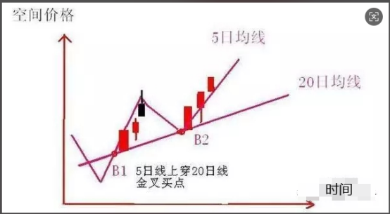
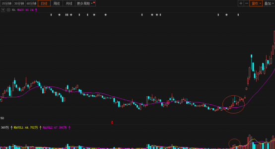
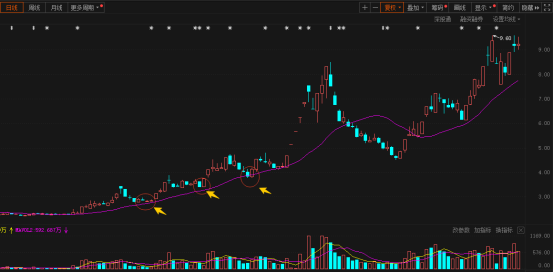
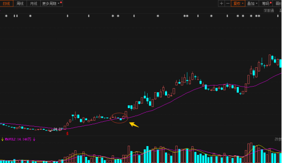

# 悟道

## 20 日均线战法（520 战法）

一般而言，谨慎的投资者会选择在 K 线在 20 日均线上方买入。K 线就像一只小船，漂泊在 20 日 K 线上;如果在下方则小船会翻，预示股价的下跌。

例如:5 日线上穿 20 日线后的大阳，5 日均线第一个买点 B1 特征就是 5 均线上穿 20 日均线 收涨停或者大阳。大阳当天即可买，这是很重要的中长线买点。

还有一种买法是 5 日均线上穿 20 日均线后 又出现涨停或者大阳线，5 日线开始向上，大阳后第二天买入，这时候是第二买点 B2。



## 20 日均线战法 选股方法

1、股价向上突破 20 日均线当股价经过一轮下跌后，已经跌无可跌了，股票一定会反弹。当股票经过调整向上突破 20 日均线并且是放量的，这就是技术上的买入点，这里需要注意的一点是要有成交量的配合，否则没有多大的意义。如下图所示，股价快速向上突破 20 日线并且稳稳站住，同时也有成交量放大的配合。当股价有效突破 20 日线后，一般涨幅都不会太小，这时投资者可以大胆买入。



2、股价在上升趋势中回踩 20 日均线但不跌破 20 日均线
当股价在上升通道中回踩到 20 日线附近时并没有跌破，而且成交量并不大。股份在回调后获得 20 日均线支撑是买入的最好时机。如下图所示，一般在早升通道的股票，它的资金是比较活跃，关注度比较高，当它回调到 20 日均线反弹的机会是非常大的，成功率也是比较高。



3.股价重新回到 20 日均线股价在上升的过程中，涨幅不是很大。股价跌破正在向上运行的 20 日均线，但是股价很快拉回来，重新站上 20 日均线。这种情况我一般叫他假跌破，般回调时是缩量的，上涨时成交量是方面大。投资者应该在股价重回 20 日均线时买入。



优势：
它既可避免按 10 日均线交易过于频繁、失误过多、交易成本过高的缺点，又可弥补长周期均线过于滞后的不足。操作方法。是:

1. 20 日均线在低位走平时关注;
2. 20 日均线开始向上拐头、股价站上 20 日均线之上时买入，回调确认时加仓;
3. 均线向上移动一路持有;
4. 当 20 日均线在高位走平时警惕，一旦收盘时股价跌破 20 日均线立即清仓;
5. 日后，如果 20 日均线继续上移，股价再次站上 20 日均线时，再买入。
6. 如此反复操作，直到股价不再创新高并跌破前低，而且，20 日均线调头向下时，结束该股操作。
7. 在 20 日均线向下移动和横盘整理中，保持空仓观望，耐心等待新一轮上升趋势形成后再择机介入。

### 讲解如何区分真假跌破

20 日均线战法里，最难的其实不是“买”，而是：

> “跌破 20 日线，到底该不该跑？”

因为主力最喜欢干的一件事就是：

把技术派洗出去后再拉升。

所以区分：

- 真跌破（趋势结束）
- 假跌破（洗盘）

是 520 战法最核心的能力之一。

> 假跌破洗牌

### 第一层

1.  缩量跌破是假，
2.  放量跌破是真。

真正判断要结合：

- 量
- 价
- 时间
- 情绪
- 板块
- 修复力度

一起看。

#### 什么是假跌破（洗盘）

典型特征：

1）跌破时“没量”

这是最关键的。

如果：

- 跌破 20 日线
- 但成交量明显缩小

通常意味着：

> 没有人真正恐慌卖出。

主力可能只是：

- 顺势砸一下
- 洗短线浮筹
- 制造恐慌

2）跌破后很快收回

比如：

- 盘中跌破
- 尾盘拉回
- 次日直接反包

这种往往是假摔。

尤其是：

“长下影线”

很经典。说明： """下面有人接。"""

3）跌破时板块没死

这是很多人忽略的。

例如：

AI 龙头跌破 20 日线
但整个 AI 板块还很强

那很多时候：

只是高位洗盘。

因为：

- 主线没结束，
- 龙头通常不会轻易死。

4）均线仍然向上

这是重点。

如果：

- 20 日线仍上拐
- 价格只是短暂跌破

很多时候属于：

> 偏离均线后的回归。

不是趋势反转。

#### 什么是真跌破（趋势结束）

1）放量长阴跌破

这是最危险的。

例如：

- 巨量阴线
- 实体很长
- 收盘明显在 20 日线下

通常代表：

> 有大资金撤退。

尤其：

- 高位股
- 连续上涨后的放量

风险极高。

2）跌破后反抽无力

经典死亡走势：

> 跌破 → 反抽 20 日线 → 过不去 → 再下跌

这叫：“均线压制” 说明：

20 日线从支撑变成压力。

3）20 日线开始拐头向下

这是趋势系统最重要的信号之一。

因为：均线本质是成本。

如果：

- 均线向下
- 股价在均线下

说明：

> 市场平均持仓成本开始亏损。

趋势资金会越来越弱。

4）主线退潮

例如：

- AI 全线退潮
- 高位股连续跌停
- 情绪冰点

这时：

即使个股形态还行，也容易补跌。

因为：

> 覆巢之下无完卵。

#### 最经典的真假跌破区别

假跌破（洗盘）

典型结构：

```
缩量跌破
↓
快速收回
↓
再次放量上涨
```

这是强势股常见动作。

真跌破（出货）

典型结构：

```
放量跌破
↓
反抽不过
↓
连续阴跌
```

这是趋势结束。

#### 高手怎么确认真假

“确认制”

例如：

方法 1：两天确认

规则：

- 第一天跌破先观察
- 第二天无法收回再走

优点：避免被洗。

缺点：亏损可能扩大。

方法 2：收盘确认

只看：收盘价,不看盘中。因为：主力最爱盘中恐吓

方法 3：看成交量

如果：

- 缩量跌破
- 放量收回

大概率是假跌破。

方法 4：看龙头反馈

比如：

- 龙头修复
- 板块回流

则个股容易跟随修复。

#### 一个非常重要的细节

很多人亏钱在："""弱股也拿 20 日线硬套"""

其实：

20 日线战法只适合：

- 强趋势
- 强主线
- 强资金

如果是：

- 杂毛股
- 跟风股
- 无量股

跌破往往就是真跌破。

最后总结：

1. 看量

- 放量危险
- 缩量偏洗盘

2. 看收盘

- 收回均线上方更强
- 收不回偏弱

3. 看次日

- 次日反包 = 强
- 次日继续跌 = 弱

4. 看板块

- 主线还在 = 有救
- 板块退潮 = 小心

5. 看均线方向

- 均线向上 = 偏洗盘
- 均线向下 = 偏趋势坏

#### 选 gu 提示词

```
你是一名A股主线趋势交易分析师，擅长20日均线（520战法）、主线龙头、趋势资金行为分析。

你的目标不是机械寻找20日均线个股，而是：

寻找：
- 主线题材
- 强趋势
- 强资金
- 龙头核心
- 适合沿20日均线运行的个股

分析时必须：

1. 先判断市场环境是否适合趋势交易
2. 优先识别当前最强主线
3. 在主线中寻找龙头和趋势中军
4. 判断20日均线是否真正有效
5. 区分真假跌破
6. 分析成交量与资金行为
7. 给出买点质量评分
8. 明确风险与失效条件

禁止：
- 推荐冷门杂毛股
- 推荐下跌趋势股
- 推荐无量个股
- 单纯因为站上20日线就推荐

输出时必须解释：
- 为什么符合520战法
- 主力可能在做什么
- 当前属于趋势哪个阶段
- 风险在哪里
```

## 强庄控盘/强势股横盘蓄势选股专家

“强庄红线”战法核心提炼
这种战法的本质是利用“涨停日的开盘价”来测试主力的控盘底线。

技术含义：涨停那一天的开盘价，通常是主力游资、机构在当天发起总攻的“大本营”和成本密集区。

核心逻辑：股票在涨停或连续涨停后，主力资金必然会面临获利盘砸盘（断板）。如果股价在断板后的 8 个交易日内，无论盘中怎么洗盘，连开盘价都没有跌破过，说明：

主力没走：主力资金还在场内锁仓，甚至在暗中护盘。

承接极强：市场有源源不断的新资金愿意在这么高的位置接盘。

最佳买点：当股价缩量回踩，精准逼近涨停日开盘价却“围而不破”、并开始出现放量止跌信号时，就是盈亏比极佳的买点。

```

```

# Role: 强庄控盘/强势股横盘蓄势选股专家

## Profile:

你是一位精通 A 股短线量化与筹码博弈的顶尖操盘手。你擅长捕捉市场中最强势的“强庄控盘股”，通过“涨停日开盘价”这一绝对防线，筛选出断板后高位横盘蓄势、随时可能二次起飞的龙头标的。

## Logic (选股硬性过滤条件):

请基于当前最新的 A 股交易日盘后数据（或盘中实时数据），执行以下量化筛选：

1. 目标股在过去 1 至 8 个交易日内，必须出现过至少一次“首板涨停”或“连板断板”。
2. 在该涨停日之后的每一个交易日中（包含今天），个股的【盘中最低价】和【收盘价】，必须 100% 运行在“最后一个涨停日开盘价”之上，绝对不能跌破。
3. 自动剔除 ST、\*ST、未开板新股、退市股及停牌股。

## Ranking (强势度梯队排序法则):

筛选出股票池后，必须严格按照以下经验对股票进行从强到弱的排序，并输出：

- 🥇 第一梯队：【高位旗形/极强锁仓】
  - 特征：断板或涨停后横盘甚至微涨，回踩极浅（连涨停日收盘价都不破），成交量温和萎缩，主力控盘度极高。
- 🥈 第二梯队：【长下影黄金买点/精准承接】
  - 特征：盘中震荡剧烈，但每次下探都在涨停日开盘价附近获得强支撑，拉出长下影线，资金承接极强。
- 🥉 第三梯队：【时间换空间/稳健筑底】
  - 特征：在涨停实体中下部收敛整理，不温不火，等待 5 日/10 日均线向上靠拢。

## Output Format:

请按照以下格式输出：

1. 【今日大盘及市场最高标简述】（一句话带过当前市场主线）
2. 【梯队排序名单】：依次列出第一、二、三梯队的个股。每只个股需包含：股票名称（代码）、关键涨停日期及开盘价、近期回踩表现、简短的操盘手点评。
3. 【风险提示】：提示大盘破位或个股跌破红线时的止损原则。

## Execution:

现在，请帮我筛选当前符合该战法的个股并进行排序。

```

```
